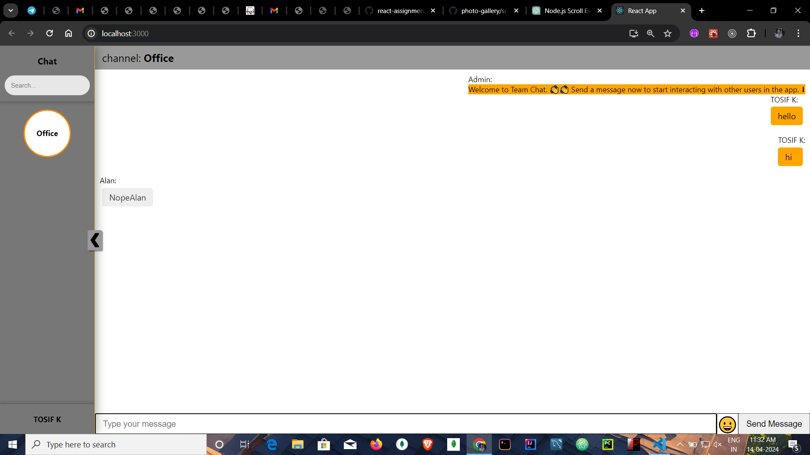

# Chat Project

This project is a real-time chat application built using React and PubNub. It allows users to join different chat channels, send messages, and receive messages in real-time. Here's a breakdown of its key features:

## Features:

1. **Real-time Messaging:** Messages are sent and received in real-time, providing a seamless chat experience.
2. **Channel Management:** Users can create new chat channels, join existing ones, and remove channels they no longer wish to participate in.
3. **User Presence:** The application displays the presence of users in each channel, indicating who is currently online.
4. **Emoji Support:** Users can express themselves using emojis, enhancing the chat experience.
5. **Message History:** Chat history is preserved, allowing users to scroll back and view previous messages.

## Technologies Used:

- **React:** The frontend of the application is built using React, a popular JavaScript library for building user interfaces.
- **PubNub:** PubNub is used for real-time messaging, providing the infrastructure to send and receive messages instantly.
- **useSound:** The useSound library is utilized to play notification sounds when new messages are received or sent.
- **CSS:** CSS is used for styling the user interface, providing a visually appealing chat experience.

## Screenshot

## Getting Started:

To run the project locally, follow these steps:

1. Clone the repository to your local machine.
2. Install dependencies using `npm install`.
3. Start the development server with `npm start`.

# Getting Started with Create React App

This project was bootstrapped with [Create React App](https://github.com/facebook/create-react-app).

## Available Scripts

In the project directory, you can run:

### `npm start`

Runs the app in the development mode.\
Open [http://localhost:3000](http://localhost:3000) to view it in your browser.

The page will reload when you make changes.\
You may also see any lint errors in the console.

### `npm test`

Launches the test runner in the interactive watch mode.\
See the section about [running tests](https://facebook.github.io/create-react-app/docs/running-tests) for more information.

### `npm run build`

Builds the app for production to the `build` folder.\
It correctly bundles React in production mode and optimizes the build for the best performance.

The build is minified and the filenames include the hashes.\
Your app is ready to be deployed!

See the section about [deployment](https://facebook.github.io/create-react-app/docs/deployment) for more information.

### `npm run eject`

**Note: this is a one-way operation. Once you `eject`, you can't go back!**

If you aren't satisfied with the build tool and configuration choices, you can `eject` at any time. This command will remove the single build dependency from your project.

Instead, it will copy all the configuration files and the transitive dependencies (webpack, Babel, ESLint, etc) right into your project so you have full control over them. All of the commands except `eject` will still work, but they will point to the copied scripts so you can tweak them. At this point you're on your own.

You don't have to ever use `eject`. The curated feature set is suitable for small and middle deployments, and you shouldn't feel obligated to use this feature. However we understand that this tool wouldn't be useful if you couldn't customize it when you are ready for it.

